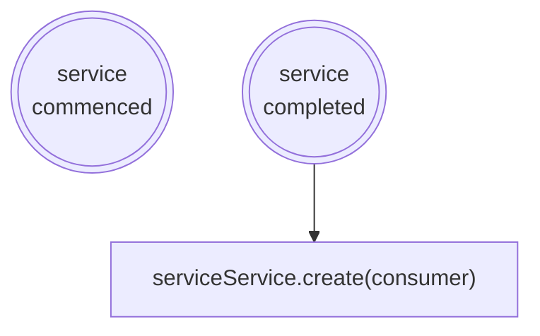
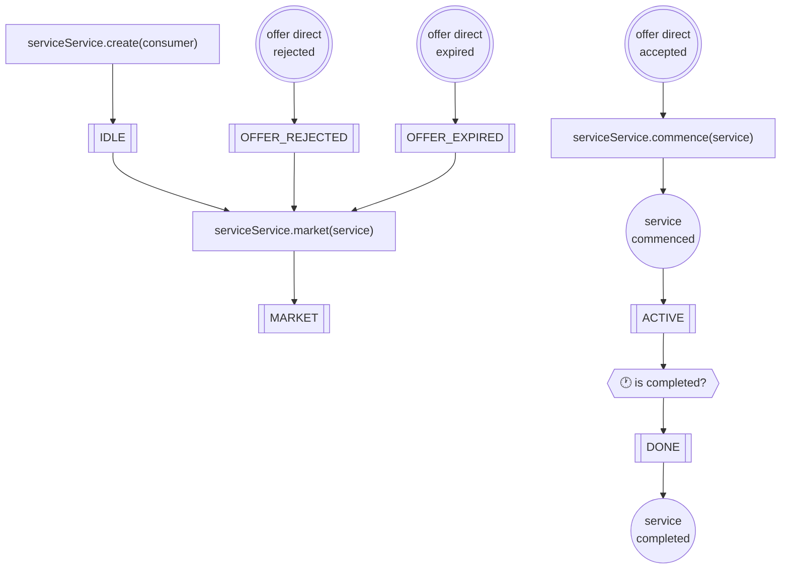
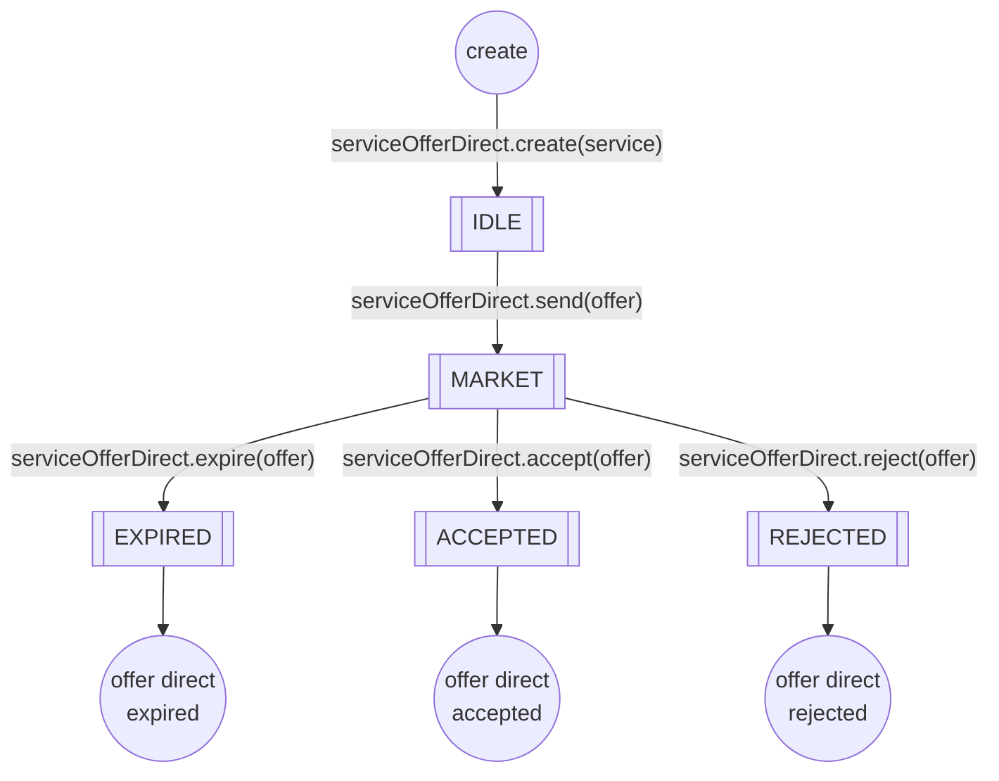

# shr-mfg-cpl-sim

## Consumer

```mermaid
graph TD
    E1((("service <br>commenced")))
    E2((("service <br>completed")))-->T1["serviceService.create(consumer)"]
    
```

## Service

### States

```mermaid
graph 
    A[[IDLE]]
    B[[MARKET]]
    D[[ACTIVE]]
    E[[DONE]]

    AA["serviceService.create(consumer)"] --> A
    A --> T1["serviceService.market(service)"] --> B
    T3((("offer direct <br>accepted"))) --> C["serviceService.commence(service)"] 
    C-->T6((service<br>commenced))-->D
    D --> T4{{"&#128336 is completed?"}} --> E
    E-->T5(("service <br>completed"))

    T7((("offer direct <br>rejected")))-->T11[[OFFER_REJECTED]]-->T1
    T8((("offer direct <br>expired")))-->T12[[OFFER_EXPIRED]]-->T1
    

    
```

## Offer direct

### States

```mermaid
graph
    A0(("create"))-->|"serviceOfferDirect.create(service)"|A
    A[[IDLE]]
    B[[MARKET]]
    C[[EXPIRED]]
    D[[ACCEPTED]]
    E[[REJECTED]]
    
    A -->|"serviceOfferDirect.send(offer)"| B
    B-->|"serviceOfferDirect.expire(offer)"|C
    B-->|"serviceOfferDirect.accept(offer)"|D
    B-->|"serviceOfferDirect.reject(offer)"|E
    C --> T4(("offer direct </br> expired"))
    D-->T7((offer direct<br>accepted))
    E-->T8((offer direct<br>rejected))
    
    

```

