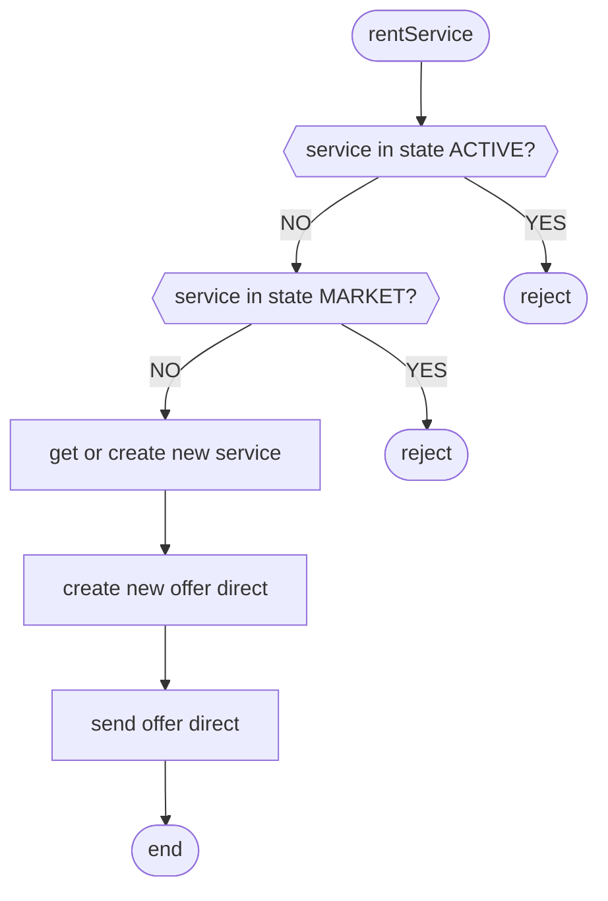
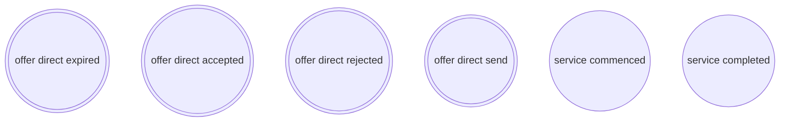
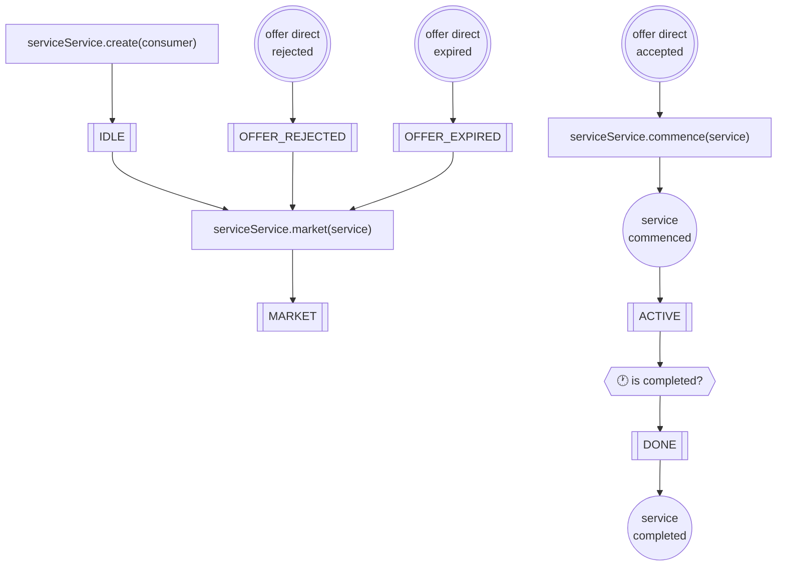
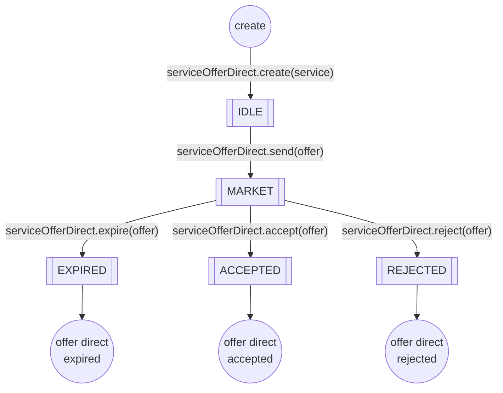

# shr-mfg-cpl-sim

## Consumer

### Properties

### Functions
* rentService

* clcOfferPrice
* clcOfferDuration
* clcOfferProvider

### Events

## Service

### States

## Offer direct

### States

